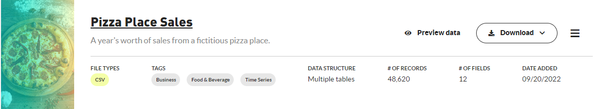
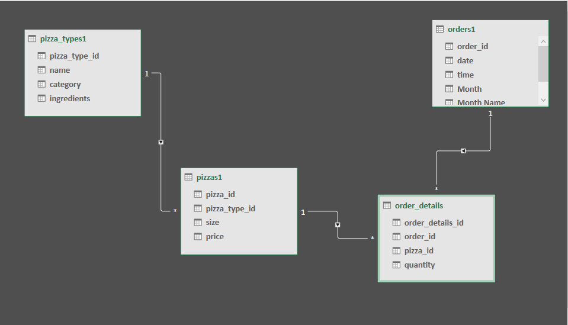
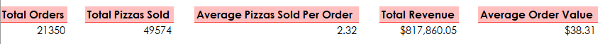
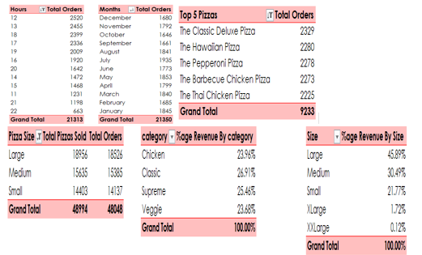
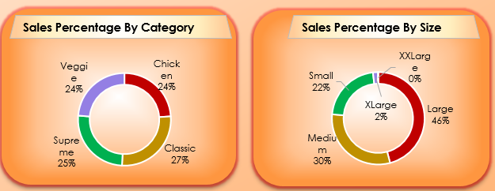
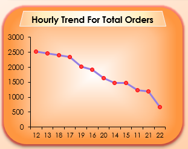
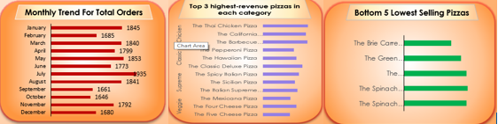
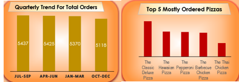
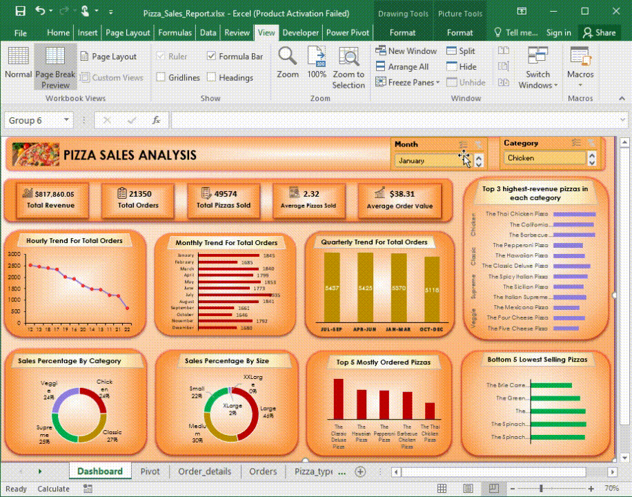

# Pizza Sales Analysis Report

Welcome to my Pizza Sales Analysis project, that show case my data analysis skills using Excel and MySQL. This project uncover insights and trends that can help in making informed business decisions for boosting business revenue. 

## Description
Following steps have been taken to complete the project:

1.	Data Import and Cleaning
2.	Exploratory Data Analysis
3.	Date Related Columns using Power Query
4.	Pivot Tables and Pivot Charts

## 1.	 Data Import 
Imported the sales data into Excel, ensured it is clean, and structured for analysis.
                                    https://mavenanalytics.io/data-playground?page=6&pageSize=5
                                                             
After downloading data set from the above link, I wrote queries in MySQL workbench and obtained the results, which I could later match with my Excel visualizations to authenticate the results.
                                                             

## 2.	 Data Cleaning:
After loading the data for editing in Power Query, I Checked for duplicates and if found removed duplicate records, missing values, or inconsistencies in the data. 

Checked for data types of columns and the header names of each table. I applied ‘use first row as header’ option on tables where I found inconsistencies.

## 3.	Data Modeling:
After loading data, built relationships between tables showing cardinality one to many amongst tables.

## 4.	Exploratory Data Analysis EDA:	

## Initial Statistics:
Calculated key performance metrics such as total sales revenue, total orders, and total pizzas sold, average pizzas per order and average order value.
## Distribution Analysis:
Examined the distribution of pizzas quantity sold by category, orders and sizes to determine purchase patterns.	
## Trend Analysis:
Investigated Sales trends over different periods i.e. hourly, monthly, and quarterly to identify peak hours and periods across different seasons.
## Categorical Analysis:
Analyzed the Percentage contribution of each pizza category to total revenue to identify bestselling pizza category.
	
    
Analyzed the percentage contribution of different pizza sizes to total revenue in order to understand customer preferences.

## 5.	Date Related Columns:
Hour: To find out peak hours of the day

Month Name: To analyze monthly trends for orders.

Month: To sort the Month Name according to Month Number

Quarter: To examine seasonal variation of orders.

## 6.	Pivot Tables:
For KPIs:

For charts:

##     Visualizations:

Pie Chart:	For viewing percentage contribution of Pizza sizes and categories to total revenue.

Line Chart:	For understanding the hourly sales trends.

Clustered Bar Chart: 	To identify monthly sales trends, top 3 highest revenue generating pizzas in each category, bottom 5 lowest selling pizzas

Clustered Column chart: to analyze quarterly sales trends, and top 5 mostly ordered Pizzas.

##          Tools and Technologies:
MySQL : Used MySQL workbench to apply database queries.

Excel:  Utilized for data exploration, basic analysis, and initial visualizations.

## Files Included:

‘Pizza_Sales_Report.xlsx’:  Excel file containing details on EDA, data transformations, and visualizations.
 		
         
 ‘Pizza Sales Analysis Report in Excel.pptx’: PowerPoint file to show summary of key findings and recommendations.

## Open the Files:

Use Excel to open `Pizza_Sales_Report.xlsx` for details on EDA and preliminary analysis.
		
Review the ` Pizza Sales Analysis Report in Excel` for a summary of insights and recommendations.

## Dashboard Preview:

